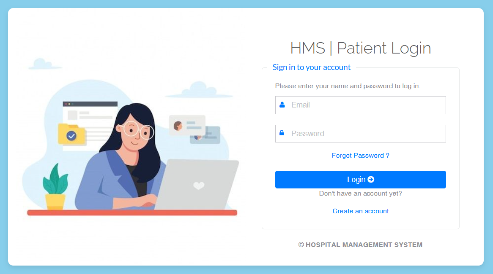
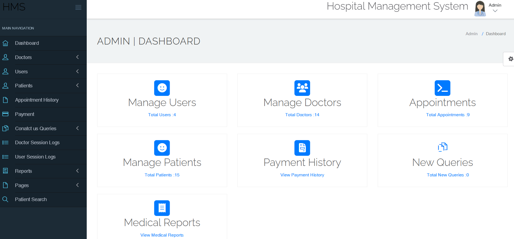
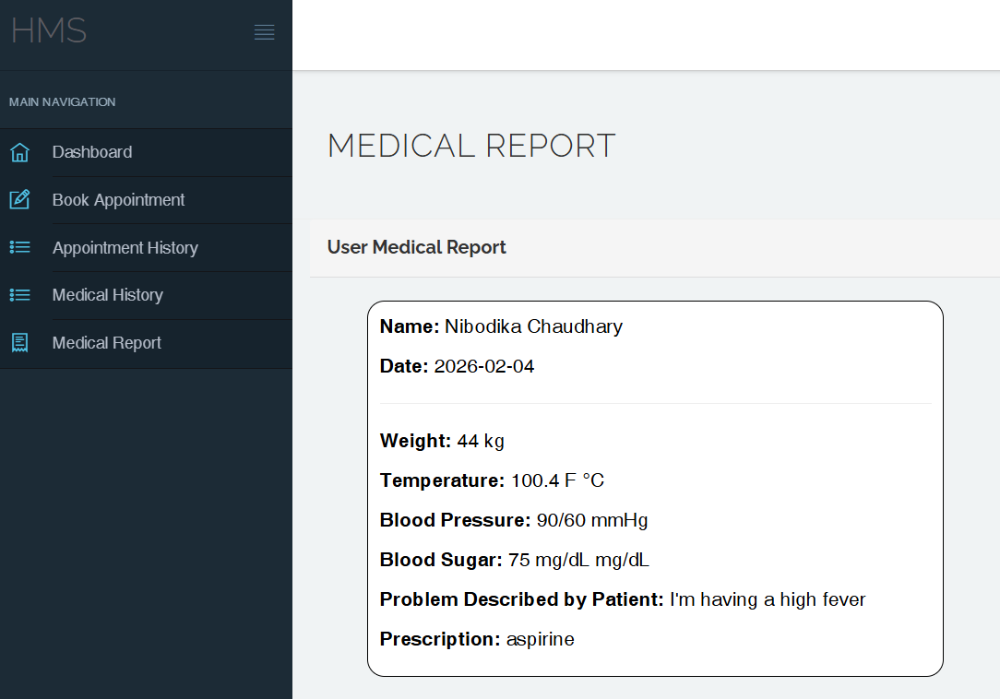

# 🏥 Hospital Management System (HMS)

This is a simple **PHP-based Hospital Management System** developed as my **Final Year Project** for B.Sc. CSIT.  
It helps manage hospital operations such as patient registration, doctor appointments, medical history, and admin tasks in a digital format.

## 📌 Features
- 🔐 Admin, Doctor, and Patient login systems  
- 🗓️ Appointment booking with priority levels  
- 📋 Patient record management  
- 🩺 Doctor specialization & fee management  
- 📜 Medical history and prescription recording  
- 📞 Contact & feedback form for users  
- 📃 About Us and Contact Us content pages  

## 🛠️ Tech Stack
- **Frontend:** HTML, CSS, Bootstrap  
- **Backend:** PHP  
- **Database:** MySQL  
- **Tools Used:** XAMPP (Apache + MySQL)  

## 💡 How to Run
1. Install **XAMPP** and start **Apache** and **MySQL**.  
2. Clone or download the project files into the `htdocs` folder of XAMPP.  
3. Create a **MySQL database** and import the provided `.sql` file.  
4. Open your browser and go to `http://localhost/project-folder-name`.  

  
  
  
  

